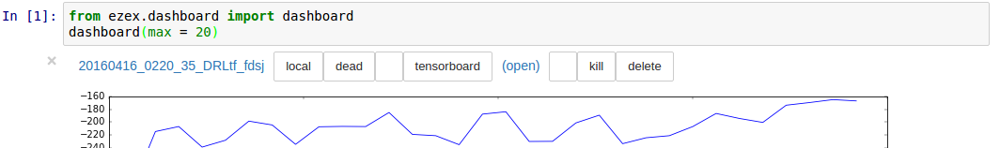

# ezex
ezex (i.e. easy experiment) is a lightweigt python package for managing experiment runs. It keeps all experiments in a single folder on a possibly shared file system and provides routines for starting/aborting jobs on computing clusters with LSF or SLURM

### Usage
```
usage: ezex {dashboard,remote,run,set}

positional arguments:
  {dashboard,remote,run,set,execute}
    dashboard           open jupyter notebook dashboard
    remote              dashboard on a remote maching via ssh port forwards
    run                 run experiments (i.e. python scripts)
    set                 set global ezex variables (e.g. experiment folder)

```
#### ezex dashboard

ezex dashboard opens a jupyter notebook which can be used to visualize the experiments (type *Shift+Enter* to execute a cell). If [TensorFlow](https://www.tensorflow.org/) is installed, experiments can also be visualized in tensorboard by clicking on *tensorboard* and then on *open*. Currently only one experiemnt at a time can be visualized in tensorboard.


### Installation
```
sudo pip install ezex
```
or
```
pip install ezex --user
```
in the second case it might be nessessary to add the line `export PATH=$PATH:$HOME/.local/bin` to `~/.profile`. The experiment folder can be changed e.g. via `ezex set -exfolder /home/$USER/scratch/ezex-experiments`